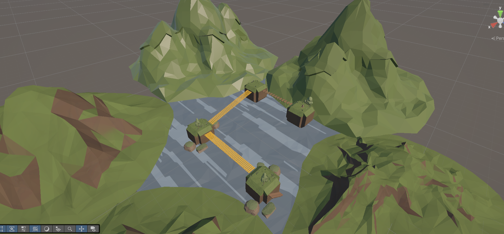

# ITU-CS-464-LAB-04-BSSE23036

**Lab 04: Player Controller**  
Implementation of a custom physics-based player controller and camera tracking system in Unity.

  

## Features Implemented

- **Environment:**
  A nature-themed, low-poly mountain lake imported from the previous blockout assignment. The layout challenges the player to traverse a series of narrow wooden suspension bridges connecting isolated square islands.
- **Player Movement (`PlayerController.cs`):**
  A custom script attached to the player capsule handling Rigidbody physics-based movement. It fully supports camera-relative directional controls, slope-climbing capabilities, and variable jump physics.
- **Camera Tracking (`CameraFollow.cs`):**
  A custom script implemented to smoothly track and orbit the player capsule as it navigates the terrain.

## Submission Documents

1.  **Playthrough Video:**
    A screen-recorded video (`playthrough.mp4`) demonstrating the player successfully navigating the level using the custom controller has been pushed to this repository.
2.  **Repository Link:**
    This GitHub repository fulfills the final submission requirement.
